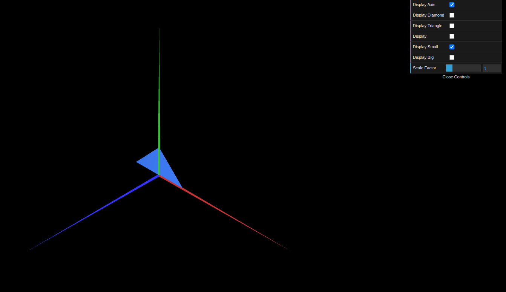
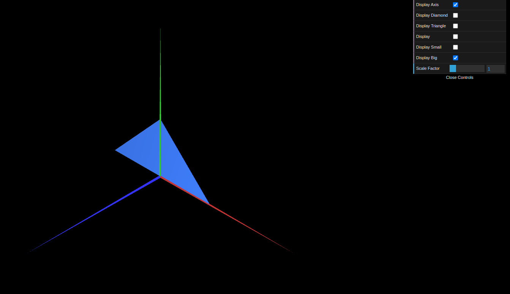
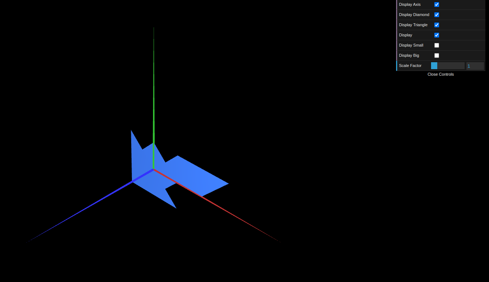

# CG 2023/2024

## Group T01G04

## TP 1 Notes

- In exercise 1 we made the `MyTriangle` and `MyParallelogram` figures and created the respective checkboxes. We observed we could make the parallelogram double-sided by repeating the indices in reversed order.
- In exercise 2 we made the `MyTriangleSmall` and `MyTriangleBig` figures and respective checkboxes. These were also made double sided.

