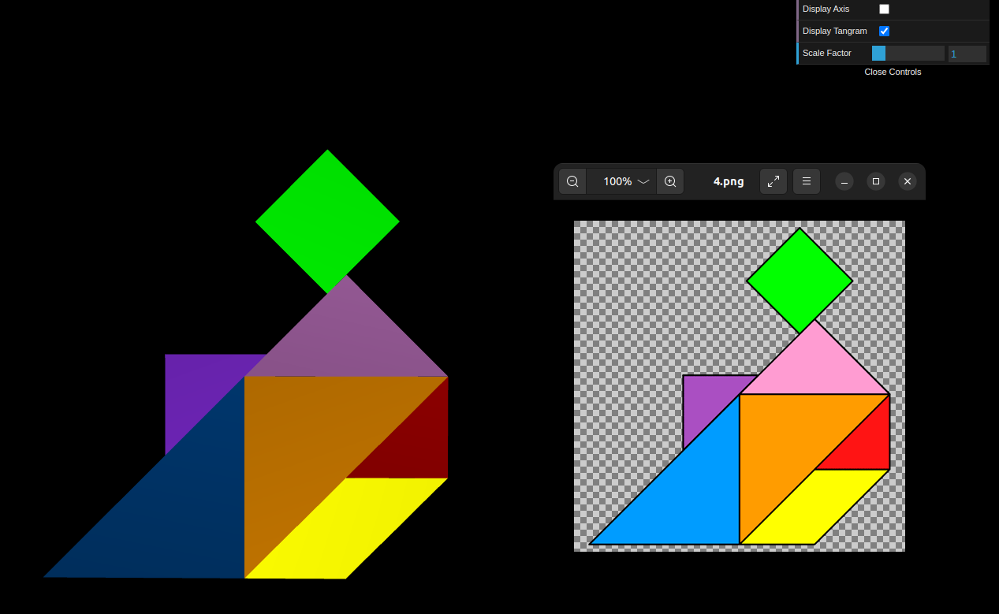
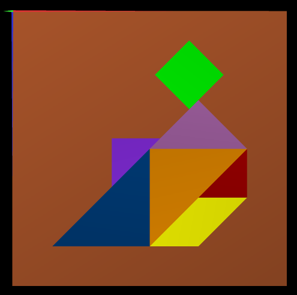
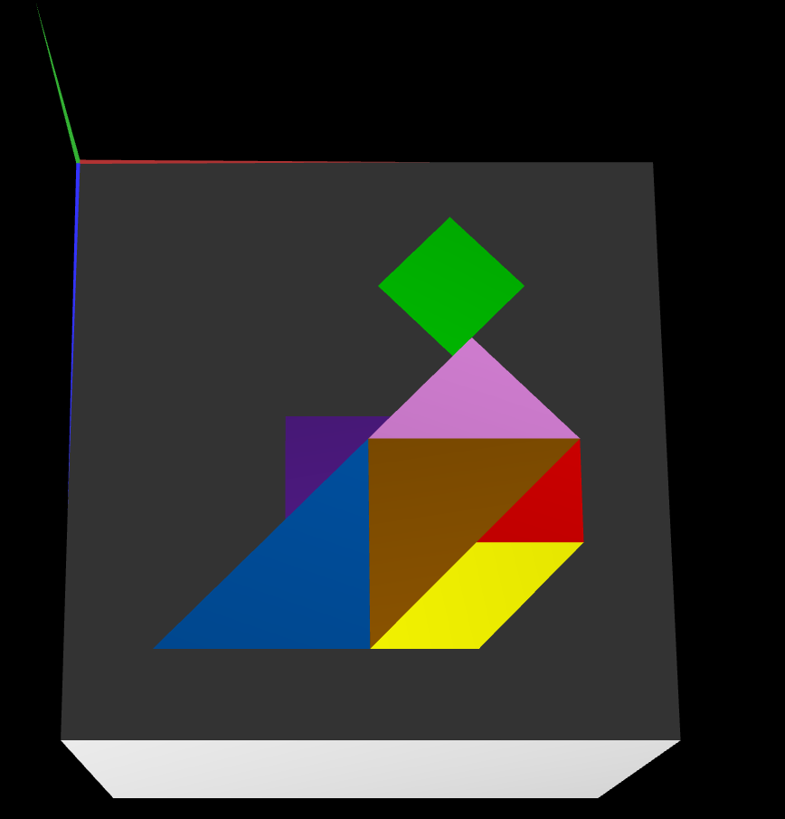

# CG 2023/2024

## Group T01G04

## TP 2 Notes

- In exercise 1, we created the `MyTangram.js` using the figures from the previous class and positioning them with necessary geometrical transformations. The most difficult pieces to position were the green diamond and the purple triangle.

- In exercise 2, we created the `MyUnitCube.js`, defined the vertices and connections necessary to create an unitary cube, centered on the space. After adding it to the scene, we applied geometrical transformations to the cube to scale it to appropriate dimensions, move it so its top left corner would be at the center coordinates, and changed its color. We also applied geometrical transformations to the tangram so it would be centered in the cube, and slightly away from it to avoid visual bugs. Finally we rotated both these objects so they would be in the XZ plane.

- In exercise 3, we created the `MyQuad.js` and `MyUnitCubeQuad.js` classes. The first being a simple unitary square centered on the plane, and the second being a cube formed by those squares, after the needed geometrical transformations. This cube was then positioned, alongside the tangram, in the same place as the cube from the previous exercise with the same transformations.

