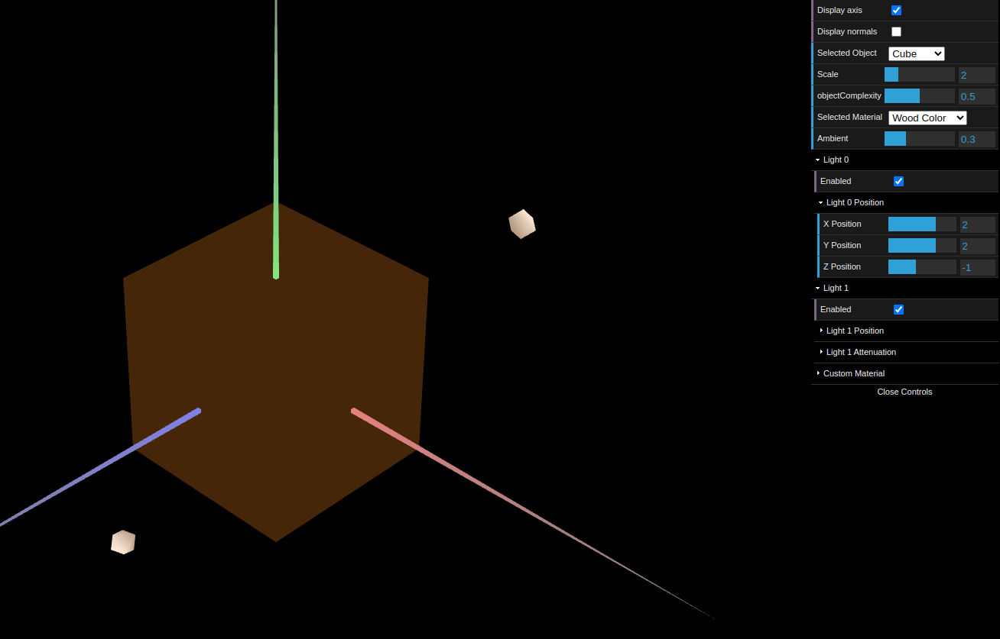
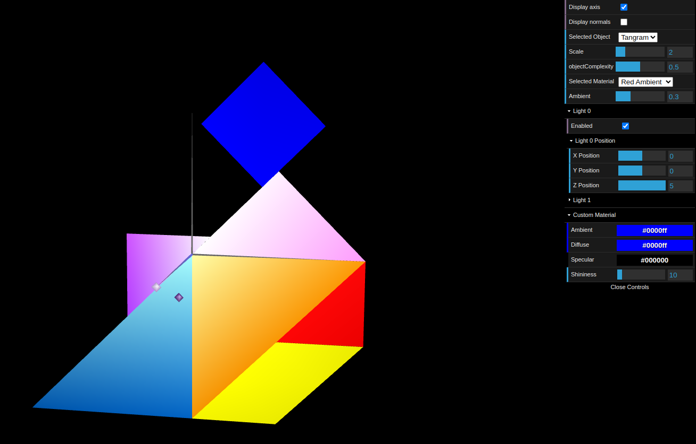

# CG 2023/2024

## Group T01G04

## TP 3 Notes

- In exercise 1, we added a couple figures we created in the previous assignment, and declared their normals to fix any lighting inconsistencies. Then we created a new Wood colored material with a low specular component.

- After this, a new material for each of the figures in the tangram was created, to match the colors displayed in the given picture. Each of these materials had a high specular component. Finally, the *Custom Material* was applied to the diamond in the tangram.

