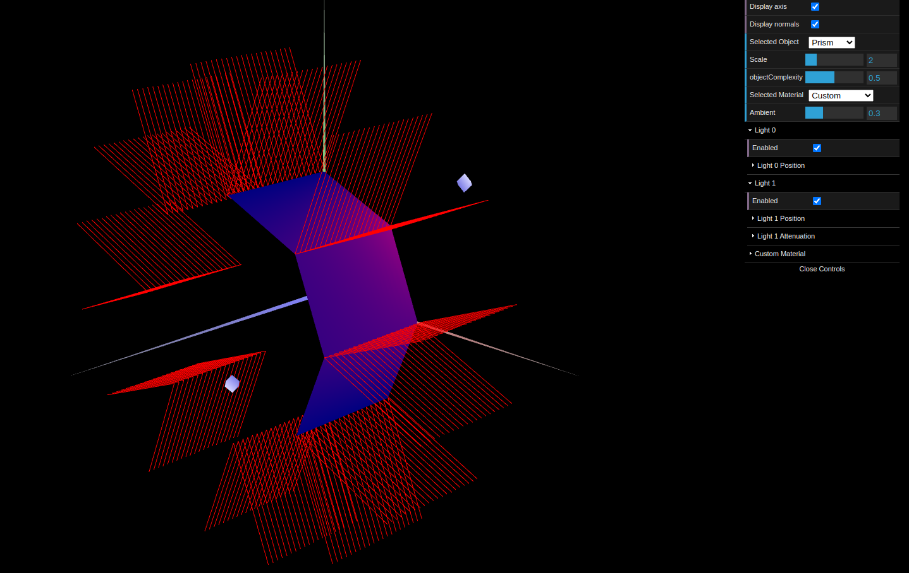
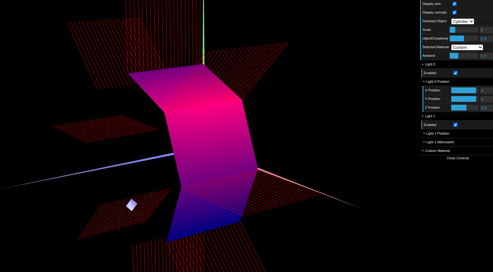

# CG 2023/2024

## Group T01G04

## TP 3 Notes

- In exercise 1, we added a couple figures we created in the previous assignment, and declared their normals to fix any lighting inconsistencies. Then we created a new Wood colored material with a low specular component.

- After this, a new material for each of the figures in the tangram was created, to match the colors displayed in the given picture. Each of these materials had a high specular component. Finally, the *Custom Material* was applied to the diamond in the tangram.

- In exercise 2 we created the `MyPrism` class. We found this exercise rather complex compared to previous tasks, because of the objective of making this prism of variable number of sides and stacks. This required the implementation of algorithms that would calculate and define the vertices, faces and normals of the prism based on the requested number of slices and stacks.

- In exercise 3 we created `MyCylinder`. This exercise was fairly simple as this object was a simple adaptation of the previously designed prism. Unnecessary vertices and normals were removed, and each vertex had a single normal, which was also easier to calculate. With the new normals and the proper lighting the object corners are smoothed giving it a rounder appearance.

