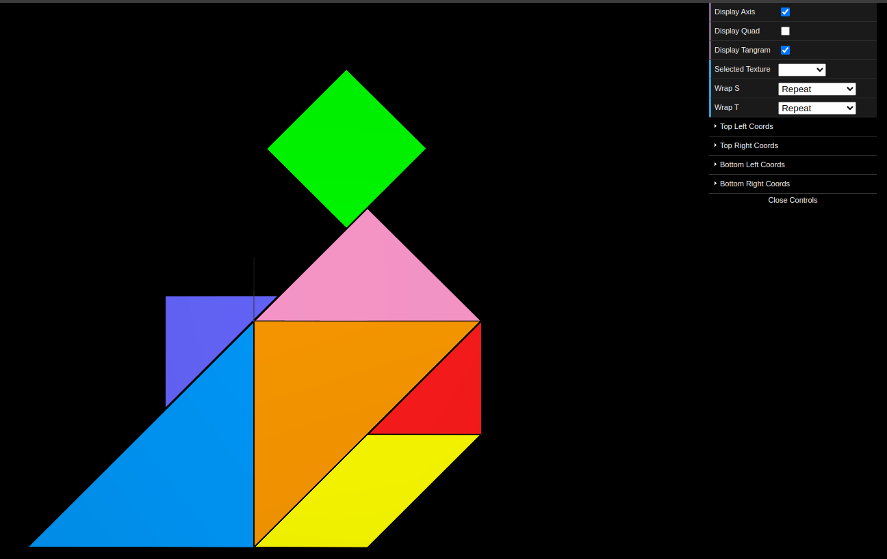
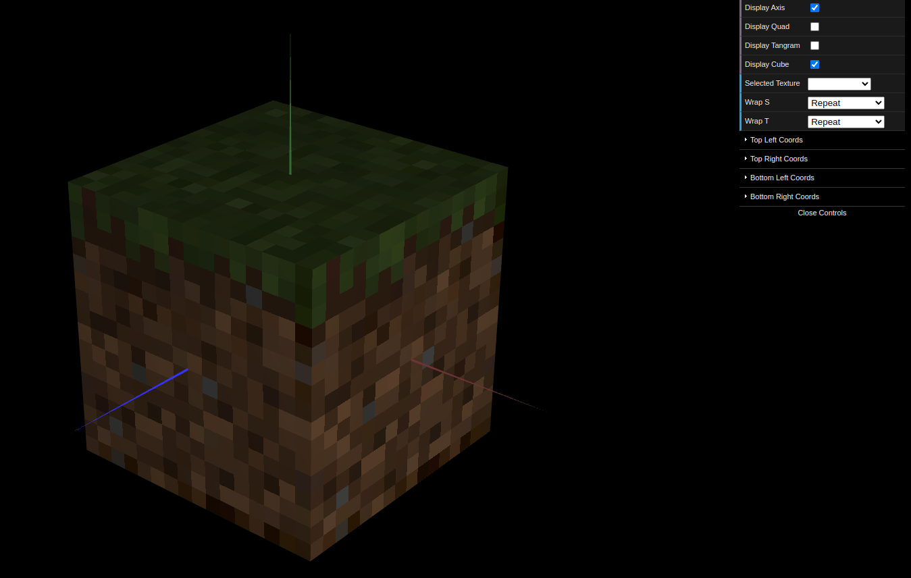

# CG 2023/2024

## Group T01G04

## TP 4 Notes

- In exercise 1 we applied a texture, based on the given image, to each of the figures forming the tangram.

- In exercise 2 we adapted the `MyUnitCubeQuad` class to receive a texture for each face. Inside this class, a material was created, and the appropriate texture was applied to that material, for each face. To fix the blurryiness, the given command was used after applying each of the textures.

