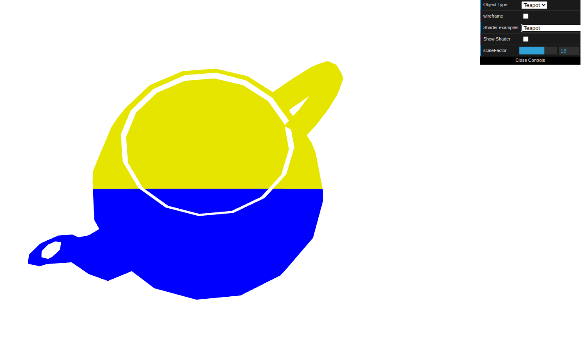
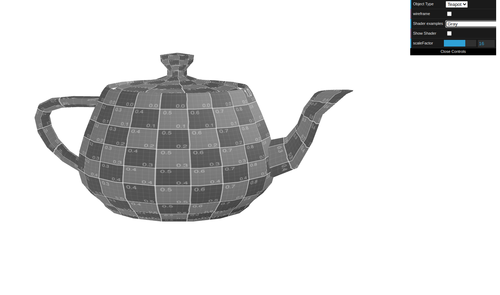
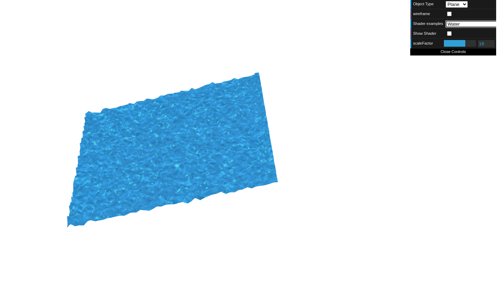

# CG 2023/2024

## Group T01G04

## TP 5 Notes

- In exercise 1 we colored the teapot based on its position.

- We then colored it Grey, based on the Sepia coloring.

- Lastly we apllied the water texture on the plane an animated it to create waves.

